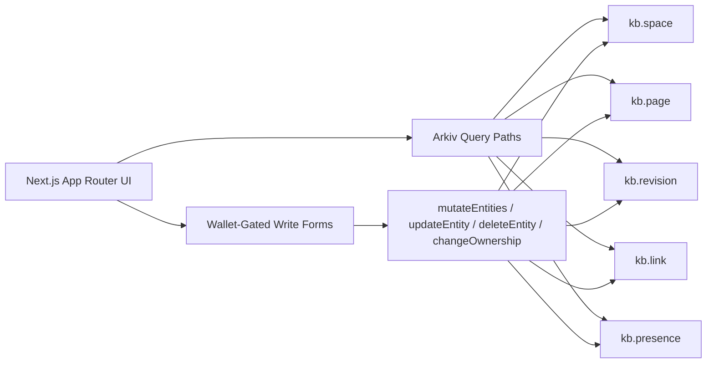
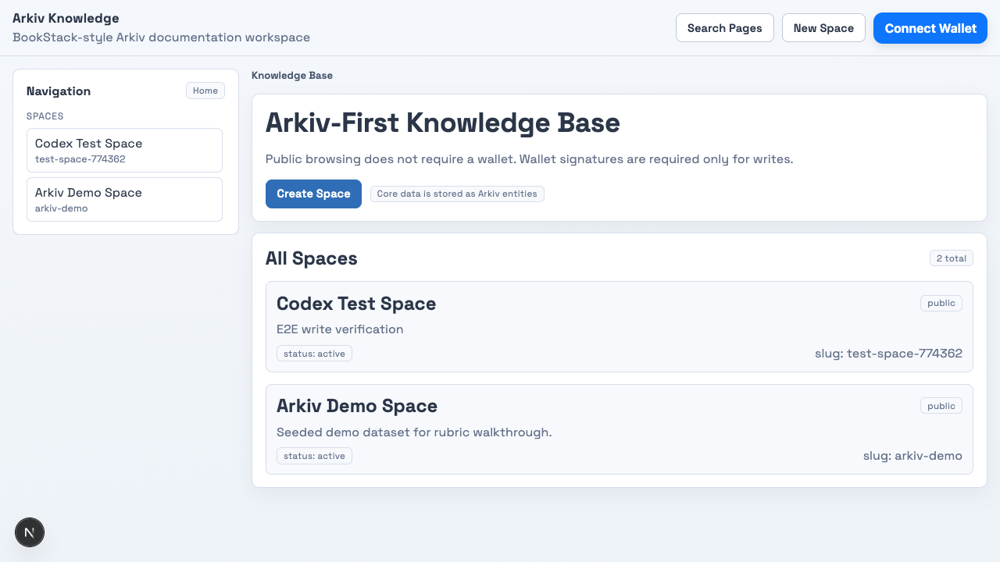
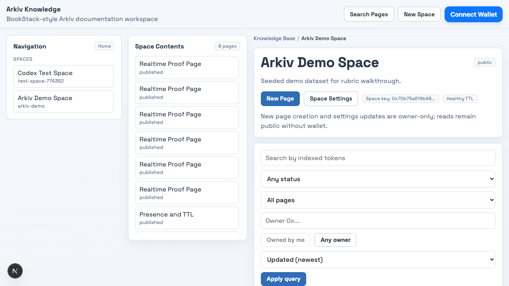
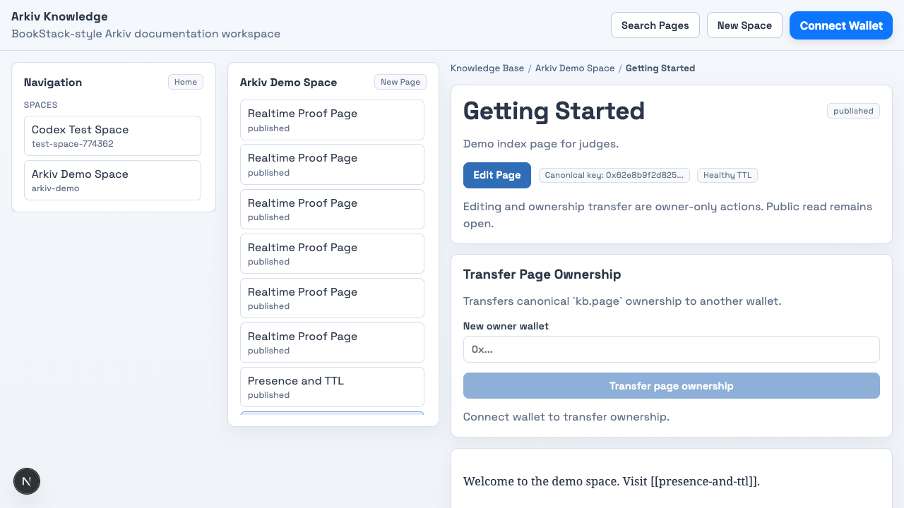
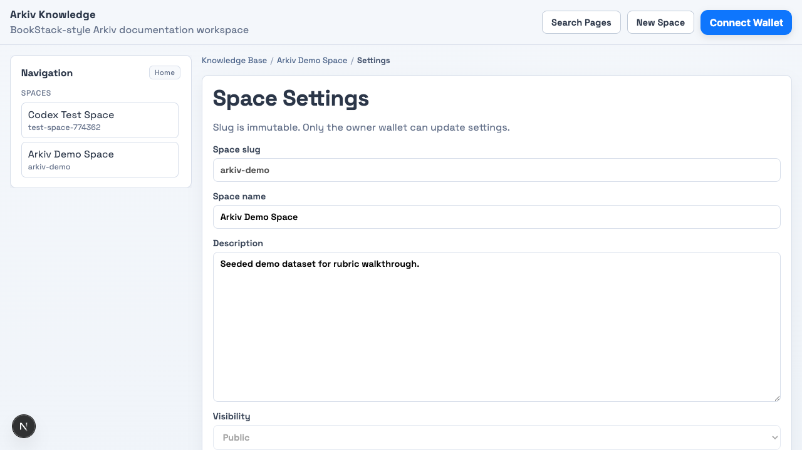

# Arkiv-First Knowledge Base

Arkiv-first documentation app built for the Arkiv Builders Challenge.

## Team Members
- Tomas (solo builder)

## Deployed Demo URL
- Local/demo-first build: `http://localhost:3000`
- Public deployment: `TBD` (replace with final hosted URL before submission)

## Why This App Scores Well
- Core domain data is stored in Arkiv entities (`kb.space`, `kb.page`, `kb.revision`, `kb.link`, `kb.presence`).
- Canonical page updates use `updateEntity` semantics through `mutateEntities`, while revisions remain append-only.
- Page edits preserve canonical `createdAt` and bump revisions using `max(revisionNo)+1`.
- Relationships are persisted as first-class link entities (`kb.link`) and rendered via query results.
- Expiration is intentional per entity type, with owner extension controls and short-lived presence entities.
- Browsing is public (no wallet). Wallet connection is required only for writes.
- Canonical slug reads are deterministic, and duplicate slug writes are rejected before mutation.
- Visibility semantics are enforced (`public` listable, `unlisted` direct-link readable, `private` owner-context only).
- Page lifecycle includes owner-only archive and delete cleanup for canonical + relationship entities.

## Architecture Diagram


## Judge Screenshots





## Stack
- Next.js 15 App Router, TypeScript, Node runtime
- Arkiv SDK `@arkiv-network/sdk@0.6.x`
- wagmi + RainbowKit wallet UX
- Vitest unit/integration/e2e tests
- Vercel-ready deployment

## Quick Start
```bash
pnpm install
pnpm dev
```

Open `http://localhost:3000`.

## Environment Variables
```bash
NEXT_PUBLIC_ARKIV_CHAIN=kaolin
NEXT_PUBLIC_WALLETCONNECT_PROJECT_ID=<walletconnect-project-id>

# Optional live write tests / seed scripts
ARKIV_LIVE_TEST_PRIVATE_KEY=<0x...>
ARKIV_DEMO_PRIVATE_KEY=<0x...>
ARKIV_CHAIN=kaolin
ARKIV_RPC_URL=https://kaolin.hoodi.arkiv.network/rpc
```

## Entity Schema
| Type | Required attributes | Payload | Default expiration |
|---|---|---|---|
| `kb.space` | `type`, `schemaVersion`, `spaceSlug`, `visibility`, `status`, `updatedAtMs` | `{ name, description, createdAt, updatedAt }` | 365d |
| `kb.page` | `type`, `schemaVersion`, `spaceKey`, `spaceSlug`, `pageSlug`, `title`, `status`, `updatedAtMs`, `parentPageKey?`, `token_0..token_19` | `{ title, bodyMarkdown, summary, createdAt, updatedAt }` | published 365d, draft 30d |
| `kb.revision` | `type`, `schemaVersion`, `spaceKey`, `pageKey`, `revisionNo`, `editedAtMs`, `editor` | `{ title, bodyMarkdown, editSummary }` | 180d |
| `kb.link` | `type`, `schemaVersion`, `spaceKey`, `fromPageKey`, `toPageKey`, `updatedAtMs` | `{ sourceSlug, targetSlug }` | 30d |
| `kb.presence` | `type`, `schemaVersion`, `spaceKey`, `pageKey`, `viewer`, `sessionId` | `{ displayName, joinedAt }` | 90s |

## Query Paths (Arkiv-first)
- Public space list: `type=kb.space && schemaVersion=1`
- Space pages (canonical): `type=kb.page && schemaVersion=1 && spaceKey=<spaceKey>`
- Page revisions: `type=kb.revision && schemaVersion=1 && pageKey=<pageKey>`
- Backlinks: `type=kb.link && schemaVersion=1 && toPageKey=<pageKey>`
- Presence: `type=kb.presence && schemaVersion=1 && pageKey=<pageKey>`
- Space search (query-first): `type=kb.page && schemaVersion=1 && spaceSlug=<slug> && status? && owner? && parentMode(all|root|child) && (token_0=<t> OR ... OR token_19=<t>) && sort(updated_desc|updated_asc|title_asc)`
- Space search (canonical): same as above plus `spaceKey=<spaceKey>` for deterministic identity scope.
- Global page search (query-first): `type=kb.page && schemaVersion=1 && spaceSlug? && status? && owner? && parentMode(all|root|child) && tokens? && sort(updated_desc|updated_asc|title_asc)`

## Example Query Builder Usage
```ts
const spaces = await publicClient
  .buildQuery()
  .where(and([eq('type', 'kb.space'), eq('schemaVersion', '1')]))
  .withAttributes(true)
  .withPayload(true)
  .fetch()
```

```ts
const backlinks = await publicClient
  .buildQuery()
  .where(and([eq('type', 'kb.link'), eq('schemaVersion', '1'), eq('toPageKey', pageKey)]))
  .withAttributes(true)
  .withPayload(true)
  .fetch()
```

```ts
const mutation = await walletClient.mutateEntities({
  updates: [pageUpdate],
  creates: [revisionCreate, ...linkCreates],
  deletes: oldLinkEdges.map((edge) => ({ entityKey: edge.entityKey }))
})
```

```ts
const transfer = await walletClient.changeOwnership({
  entityKey: canonicalPageKey,
  newOwner: nextOwner
})
```

## Ownership and Read/Write Boundary
- Read routes (`/`, `/spaces/[spaceSlug]`, `/spaces/[spaceSlug]/[pageSlug]`) are public.
- Write routes and buttons (`/new/space`, create/edit page, `/spaces/[spaceSlug]/settings`, presence join, extend TTL) require wallet connection.
- Space settings updates and transfer are owner-gated; non-owners can view settings in read-only mode with explicit messaging.
- Canonical page edit and transfer are owner-gated; non-owners can browse page content but cannot submit edits.
- Canonical page lifecycle actions are owner-gated:
  - archive updates canonical page status to `archived` and appends a revision,
  - delete removes canonical `kb.page` and cleans dependent `kb.link`, `kb.presence`, and `kb.revision` entities.
- Extension controls are owner-checked in UI and only enabled for near-expiry entities.

## Lifecycle / Expiration Policy
- Long-lived: spaces and published pages (365d)
- Medium: revisions (180d)
- Regenerated medium: links (30d)
- Ephemeral: presence (90s) with heartbeat extension
- Revision retention policy:
  - archive: preserve full revision history (append archive revision),
  - delete: remove canonical page and all revisions in the same cleanup mutation.

## Scripts
```bash
pnpm verify                # lint + typecheck + tests + build + live smoke (skip-safe)
pnpm verify:evidence       # checks required submission/evidence docs and capture script presence
pnpm verify:submission     # validates README submission sections/assets and clip+manifest capture support
pnpm evidence:capture      # deterministic Playwright screenshot/report artifact pack (fail-soft realtime)
pnpm seed:demo             # idempotent demo data seed (requires key)
pnpm restore:demo          # re-run seed script for fallback dataset
pnpm verify:phase all      # file-level phase verification
```

## Testing
- Unit: schema contracts, parser behavior, expiration policy, link extraction, hierarchy tree logic, ownership permission rules
- Integration: query predicate generation (including parent-mode + global search filters), canonical update + revision + link rewrite mutation path, parentPageKey write path, ownership transfer mutation contract
- Integration: create-flow repair behavior for failed follow-up mutations (canonical page created, revision/link repair attempted)
- E2E (component-level): no-wallet read / wallet-gated write boundary + owner/non-owner settings gating + parent selector/guard behavior + ownership transfer handoff + filter serialization (`owner`, `sort`, `parent`, `status`, `q`)
- Live smoke (optional): create + read-back against Arkiv network

## Submission Evidence
- Rubric mapping file: `SUBMISSION_EVIDENCE.md`
- Deterministic artifacts: `output/playwright/evidence-pack/`
- CI policy:
  - `ci.yml` runs full verify plus fail-soft evidence upload.
  - `evidence-strict.yml` runs scheduled/dispatch strict capture (fail-hard) with funded demo key.
- Artifact package now includes screenshots, walkthrough clip output, trace zips, and `MANIFEST.sha256`.

## Demo Flow (3–5 min)
1. Browse spaces publicly from `/` without wallet.
2. Connect wallet and create a space (`/new/space`).
3. Open space settings (`/spaces/<slug>/settings`) and update description/visibility as owner, then show owner-only transfer control.
4. Create root + child pages with parent selector (`/spaces/<slug>/new`) as the owner wallet.
5. Show nested sidebar tree and ancestor breadcrumbs on child page.
6. Apply space search filters (`parent`, `owner`, `sort`) and show Arkiv-query-driven result changes.
7. Open global route `/search/pages` and show cross-space page discovery with same filter/sort semantics.
8. Edit page and show canonical page key stability + growing revision list.
9. Transfer canonical page ownership and demonstrate old-owner block/new-owner handoff.
10. Add wiki links and show backlinks sourced from `kb.link` queries.
11. Join presence and show short-lived active viewers.
12. Archive a page, then delete a different page and show post-delete navigation consistency.
13. Show realtime refresh with two sessions.
14. Show generated evidence pack (`ARTIFACT_INDEX.md` + screenshots + walkthrough clip + hash manifest + realtime status report).
