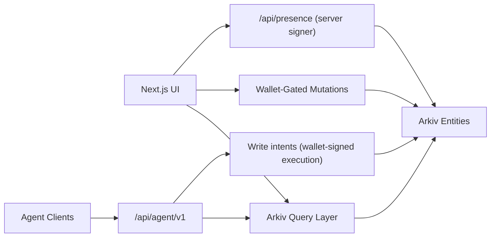

# Architecture

## System context
Arklib is a Next.js 15 App Router application where core domain entities (`kb.space`, `kb.page`, `kb.revision`, `kb.link`, `kb.presence`) are stored in Arkiv.
Reads use Arkiv public query paths. Writes use wallet-signed mutations (except delegated server-signed presence lifecycle writes).

## Data flow (read/write/agent/presence)
- Read flow:
  - Route handlers/components call `src/arkiv/queries/*`.
  - Visibility filtering uses `src/features/visibility/access.ts`.
  - Private reads require signed wallet session (`src/features/auth/session.ts`).
- Write flow:
  - UI forms call `src/arkiv/mutations/*`.
  - Wallet preflight + chain/balance checks run through `src/lib/wallet.ts`.
  - Canonical page edit path uses update + append revision + link rewrite.
- Agent flow:
  - Deterministic read APIs under `src/app/api/agent/v1/*`.
  - Write-intent APIs return serializable operation plans, executed client-side with wallet signatures.
- Presence flow:
  - Client calls `/api/presence`.
  - Server-owned signer performs join/renew/leave.
  - Presence entities remain Arkiv-native and expire quickly by policy.

## Directory responsibilities
- `src/app/*`: routes and UI composition.
- `src/app/_components/*`: shared UI and form behavior.
- `src/arkiv/schema/*`: entity contracts/builders/parsers/expiration constants.
- `src/arkiv/queries/*`: Arkiv query-building and retrieval paths.
- `src/arkiv/mutations/*`: Arkiv write wrappers and multi-entity mutation plans.
- `src/features/*`: cross-cutting domain features (auth, ownership, visibility, hierarchy, migration, agent contracts).
- `scripts/*`: submission/evidence/verification automation.
- `tests/*`: unit, integration, and e2e confidence layers.

## Boundary rules
- Core domain data must remain in Arkiv entities.
- Public browse paths must not require wallet connection.
- Wallet signatures are required for user-owned writes.
- Ownership checks must gate mutation plans and UI affordances.
- Private visibility checks must use authenticated wallet session context, not URL params.
- Agent write endpoints must return intents, not perform owner writes server-side.

## Current hotspots
- `src/features/migration/gitbook-markdown.ts` (large transform surface, high compatibility impact).
- `src/arkiv/mutations/plans.ts` (multi-entity orchestration and lifecycle correctness).
- `src/features/agent/intents.ts` (write-intent contract parity and owner enforcement).
- `src/app/spaces/[spaceSlug]/page.tsx` (dense route logic combining query/filter/visibility UI state).
